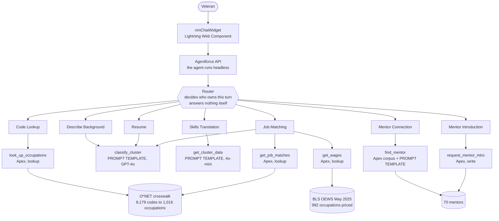
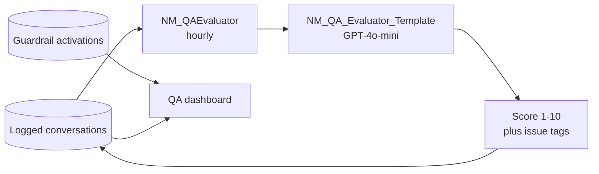

# Next Mission — how it works

**Live:** https://orgfarm-3bfff135af.my.site.com/nextmission/

An Agentforce agent that translates military experience into civilian careers.
This document explains how it is built and why.

---

## The one idea

> **The AI understands. The database remembers.**

A good doctor does not recite drug dosages from memory. They look them up. That
does not make them less of a doctor: the expertise is reading the patient, knowing
which drug, explaining what it is for. A doctor who recites dosages from memory and
gets one wrong is not more skilled. They are dangerous.

Next Mission works the same way. The agent does the understanding. It looks up the
number.

The industry name for this is **grounding**. Retrieval for facts, model for
judgment. It is the difference between an agent that demos well for ninety seconds
and one you can put in front of a veteran.

---

## Follow one conversation

A veteran types: **"I ran the reactor plant on a submarine."**

No specialty code. No keywords a database could match.

| Step | What happens | Who does it |
| --- | --- | --- |
| 1 | The **Router** reads the message and decides this is a free-text description, not a code. It hands off and answers nothing itself | Agent |
| 2 | **Describe Background** calls `classify_cluster`. A prompt template reads the sentence and recognises nuclear power operations | **GPT-4o** |
| 3 | **Job Matching** calls `get_job_matches` for that career area, and `get_wages` for the roles it is about to show | Apex, exact lookup |
| 4 | The agent writes the reply: the roles, what they pay, the source, and what to do next | Agent |
| 5 | Before the veteran sees it, every dollar figure is checked against the stored BLS record | Apex, arithmetic |
| 6 | The veteran asks for a mentor. Apex assembles all 70 active mentors; a prompt template reads their backgrounds against this veteran's and picks one | Apex **+ GPT-4o-mini** |
| 7 | Later, a second agent reads the whole conversation and scores it 1 to 10 with issue tags | **GPT-4o-mini** |

Steps 2, 6 and 7 are model calls. Steps 3 and 5 are lookups. Neither could do the
other's job, and the whole thing is worse if you swap them.

---

## The shape of it

---

## The Router answers nothing

Every turn enters at the Router. It reads the message, decides which subagent owns
it, and hands off.

The alternative is whichever subagent happens to be active answering whatever
arrives next. A veteran being shown job matches who asks "what does that pay" needs
the subagent that owns pay, not the one mid-sentence about something else. Routing
as an explicit step is what makes that reliable rather than lucky.

---

## The seven subagents

| Subagent | Owns | Actions | Reasoning by |
| --- | --- | --- | --- |
| **Code Lookup** | A specialty code: MOS, AFSC, rating, NEC | `look_up_occupations` | Apex, exact crosswalk lookup |
| **Describe Background** | No code, or a code we do not hold. Classifies from a plain description of the work | `classify_cluster` | **Prompt template**, GPT-4o |
| **Resume** | Reading an uploaded resume and rewriting it into civilian language | `classify_from_resume` | **Prompt template**, GPT-4o |
| **Skills Translation** | Turning a career area into the transferable skills behind it | `get_cluster_data` | **Prompt template**, 4o-mini |
| **Job Matching** | Real occupations, what they pay, and widening past the code when it fits badly | `get_job_matches`, `get_wages`, `broaden_classify` | Apex for the first two, **prompt template** for the third |
| **Mentor Connection** | Finding a mentor and presenting them. Does not handle consent | `find_mentor` | Apex assembles all 70, **prompt template** chooses |
| **Mentor Introduction** | Consent and sending. Never presents a mentor | `request_mentor_intro` | Apex, record write with duplicate and email guards |

**Half the agent's actions are model calls.** Each of the four Flows above is a
prompt template invocation, not plumbing.

Splitting Mentor Connection from Mentor Introduction is deliberate. One presents a
person, the other takes an explicit yes and an email address. A single subagent
doing both tends to collect the address before the veteran has been told who they
would be talking to, and an address given before that is not consent.

---

## Why some things are code

Four actions are Apex rather than a prompt template, for four different reasons.

**Scale.** 8,179 codes and 992 priced occupations do not fit in a prompt. A
template would have to recall a federal dataset from training data, which is
guessing with a citation attached.

**Exactness.** A wage figure has to match the record character for character.

**Writes.** `request_mentor_intro` creates a record, validates the email, and
blocks duplicate introductions. There is no prompt-template version of that.

**Not ranking.** `get_job_matches` returns jobs in stored order with no suitability
scoring. Ask a model for matching jobs and it will rank them, because that is what
models do with lists. This agent never ranks a veteran, and Apex is how that
becomes true rather than merely requested.

---

## Where the facts come from

Nothing is answered from the model's memory.

| Source | Grounds | Scale |
| --- | --- | --- |
| O*NET military crosswalk | Specialty code to civilian occupation | 8,179 codes, all six branches, to 1,016 occupations |
| O*NET occupations | What each civilian role involves | 1,016 |
| BLS OEWS, May 2025 | Median, 10th to 90th percentile, national employment | 992 of 1,016 priced |
| Mentor roster | Who made a similar move | 70 active, every branch |

Where BLS publishes no median, the agent says so rather than implying the job pays
nothing. Where a figure covers a wider occupational group, it says that too.

---

## Two checks on the way out

Every reply passes two verifications before the veteran sees it. Both are
arithmetic or string work, never a second model call.

**Pay figures.** Every dollar amount is extracted and matched against stored BLS
data. Anything not held is rebuilt from the system of record or withheld entirely.
The check can never add a number.

**Distress.** If someone discloses they are struggling and the reply either refuses
or carries on about careers as though they had not spoken, the Veterans Crisis Line
goes in front of the answer rather than replacing it.

Every activation writes a row to `NM_Guardrail_Event__c`, recording what the model
produced and never what the veteran said.

---

## A second agent watches the first

Quality is measured, not claimed. The evaluator grades one call per conversation
rather than per turn, and skips regression-harness traffic, which is deliberately
hostile and would misreport the agent as far worse than it is.

The guardrail log exists because the evaluator grades the stored transcript, and
the transcript holds the **corrected** reply. Without a separate record, every
catch was invisible and the safety nets were hiding the model's own failure rate.

---

## Which model, and why

| Prompt template | Model | Why |
| --- | --- | --- |
| Classify Cluster | **GPT-4o** | The decision everything downstream depends on. Wrong here and every occupation, wage and mentor after it is wrong |
| Translate Skills | GPT-4o-mini | Rewriting known cluster data into plain language |
| Find Mentor | GPT-4o-mini | Semantic match against a bounded roster |
| QA Evaluator | GPT-4o-mini | Scoring against a fixed rubric |

One call gets the larger model, and it is the one where being wrong is expensive.

---

## The client is not the product

The agent runs headless behind the Agentforce API. `nmChatWidget` is one client.
Nothing about its reasoning is bound to a visual interface, which is also an
accessibility decision: the same agent could surface through voice or another
channel without a rebuild.

---

## More

| Document | What is in it |
| --- | --- |
| [README.md](README.md) | What it is, things to try, and the command behind every claim |
| [ACCESSIBILITY.md](ACCESSIBILITY.md) | The scan, the ruleset, the numbers, how to reproduce them |
| [CONTEXT.md](CONTEXT.md) | The full engineering record, including what went wrong and what it cost |
