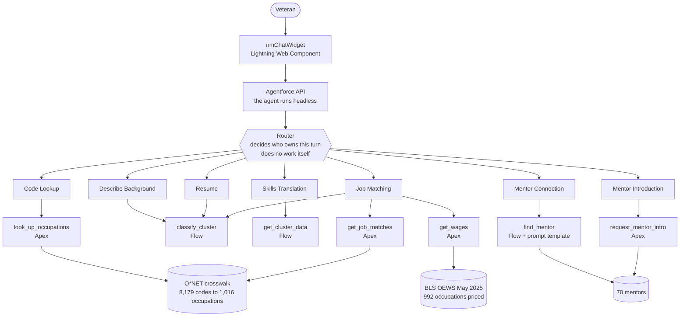
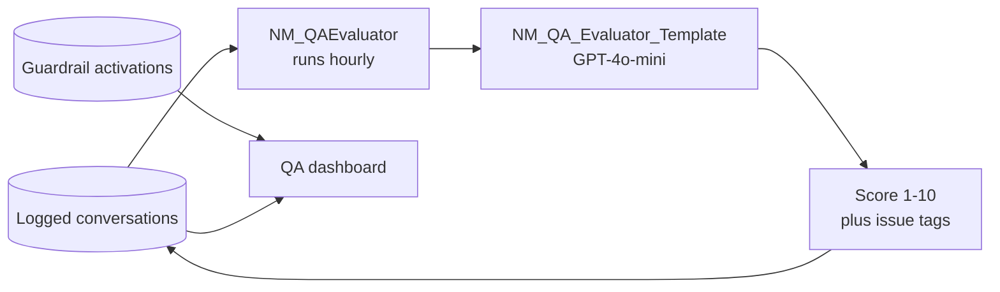

# Next Mission — architecture

How the agent is put together, what each piece owns, and why.

**Live:** https://orgfarm-3bfff135af.my.site.com/nextmission/

---

## The shape of it

---

## The Router does no work

Every turn enters at the Router. It reads the utterance, decides which subagent
owns it, and transitions. It never answers.

That matters because the alternative is whichever subagent happens to be active
answering whatever arrives. A veteran who is being shown job matches and asks
"what does that pay" should be handled by the subagent that owns pay, not by the
one mid-sentence about something else.

---

## The seven subagents

| Subagent | Owns | Actions |
| --- | --- | --- |
| **Code Lookup** | A specialty code: MOS, AFSC, rating, NEC | `look_up_occupations` (Apex) |
| **Describe Background** | No code, or a code we do not hold. Classifies from a plain description of the work | `classify_cluster` (Flow) |
| **Resume** | Everything to do with a resume: reading an uploaded one, rewriting it into civilian language | `classify_from_resume` (Flow) |
| **Skills Translation** | Turning a career area into the transferable skills behind it | `get_cluster_data` (Flow) |
| **Job Matching** | Real occupations, what they pay, and widening past the code when it fits badly | `get_job_matches`, `get_wages` (Apex), `broaden_classify` (Flow) |
| **Mentor Connection** | Finding a mentor and presenting them. Does not handle consent | `find_mentor` (Flow) |
| **Mentor Introduction** | Consent and sending. Never presents a mentor | `request_mentor_intro` (Apex) |

Splitting Mentor Connection from Mentor Introduction is deliberate. One presents a
person; the other takes an explicit yes and an email address. A single subagent
doing both tends to collect an address before the veteran has been told who they
would be talking to, and an address given before that is not consent.

---

## Where the data comes from

Nothing is answered from the model's memory.

| Source | What it grounds | Scale |
| --- | --- | --- |
| O*NET military crosswalk | Specialty code to civilian occupation | 8,179 codes, all six branches, to 1,016 occupations |
| O*NET occupations | What each civilian role actually involves | 1,016 |
| BLS OEWS, May 2025 | Median, 10th to 90th percentile, national employment | 992 of 1,016 priced |
| Mentor roster | Who made a similar move | 70 active, every branch |

Where BLS publishes no median, the agent says so rather than implying the job pays
nothing. Where a figure covers a wider occupational group, it says that too.

---

## Verification, not a second opinion

Every reply passes two checks before the veteran sees it. Both are arithmetic or
string work, never another model call.

**Pay figures.** Every dollar amount in the reply is extracted and matched against
stored BLS data. Anything not held is either rebuilt from the system of record or
withheld entirely. The check can never add a number.

**Distress.** If someone discloses they are struggling and the reply either refuses
or carries on about careers as though they had not spoken, the Veterans Crisis Line
goes in front of the answer rather than replacing it.

Every activation writes a row to `NM_Guardrail_Event__c`, recording what the model
produced and never what the veteran said.

---

## A second agent watches the first

The evaluator grades one call per conversation rather than per turn, and skips the
regression harness traffic, which is deliberately hostile and would misreport the
agent as far worse than it is.

The guardrail log exists because the evaluator grades the stored transcript, and
the transcript holds the **corrected** reply. Without a separate record, every
catch was invisible and the safety nets were hiding the model's own failure rate.

---

## Model choices

| Prompt template | Model | Why |
| --- | --- | --- |
| Classify Cluster | GPT-4o | The decision everything downstream depends on. Wrong here means every occupation, wage and mentor after it is wrong |
| Translate Skills | GPT-4o-mini | Rewriting known cluster data into plain language |
| Find Mentor | GPT-4o-mini | Semantic match against a bounded roster |
| QA Evaluator | GPT-4o-mini | Scoring against a fixed rubric |

---

## The client is not the product

The agent runs headless behind the Agentforce API. `nmChatWidget` is one client.
Nothing about the agent's reasoning is bound to a visual interface, which is also
an accessibility decision: the same agent could surface through voice or another
channel without a rebuild.

See [ACCESSIBILITY.md](ACCESSIBILITY.md) for the scan, the ruleset and the numbers,
and [CONTEXT.md](CONTEXT.md) for the full engineering record including what went
wrong and what it cost.
